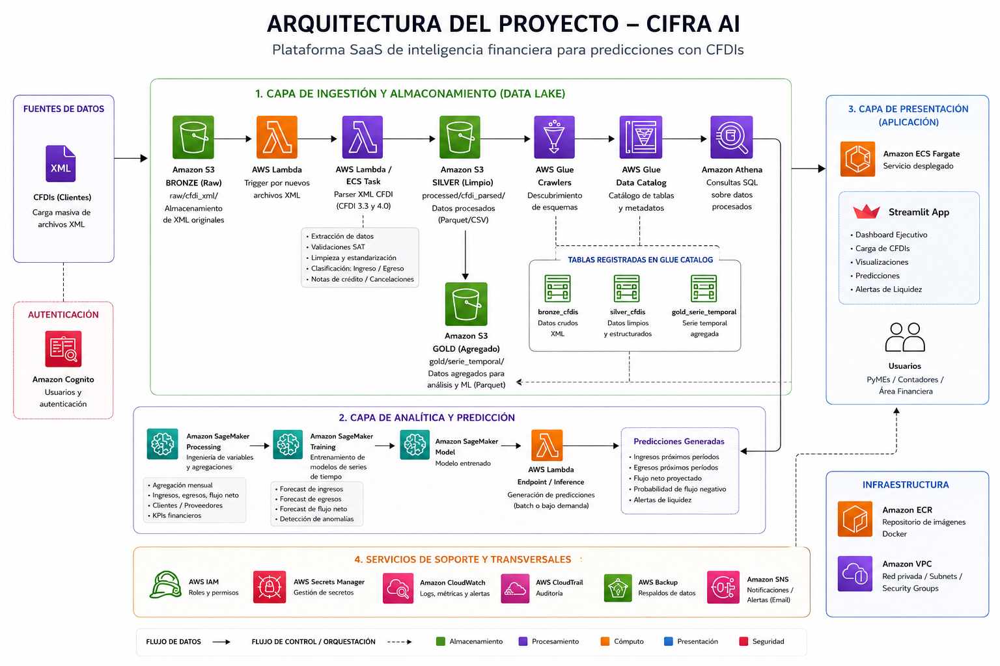
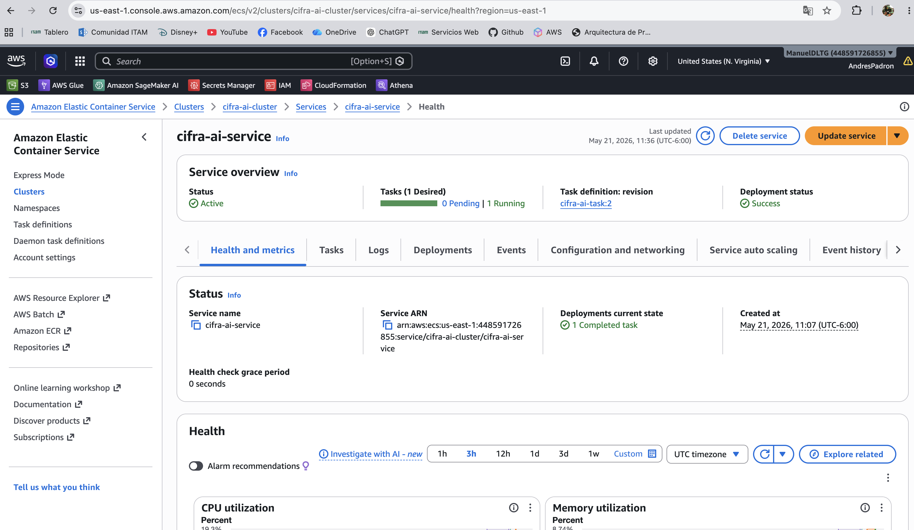
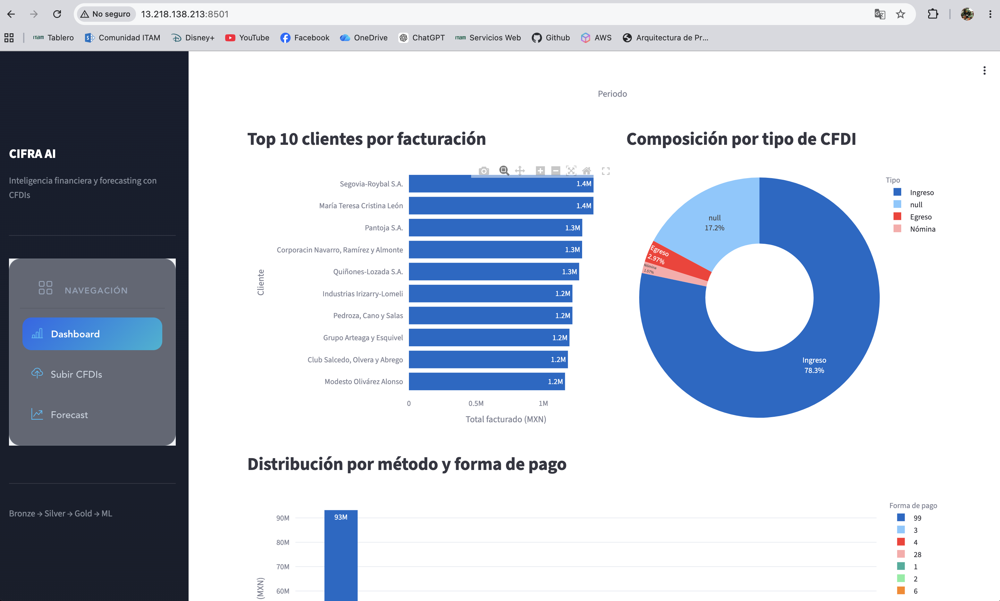
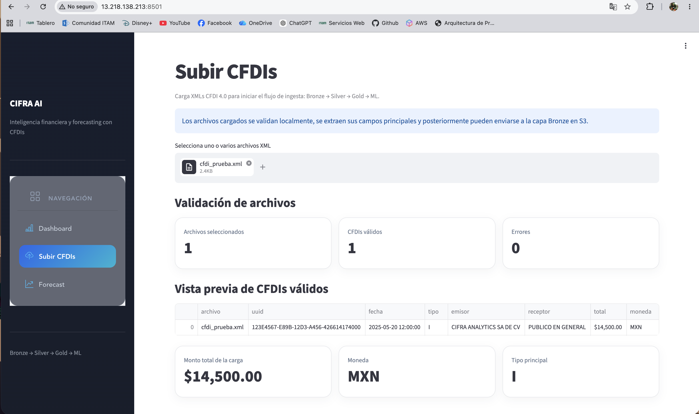
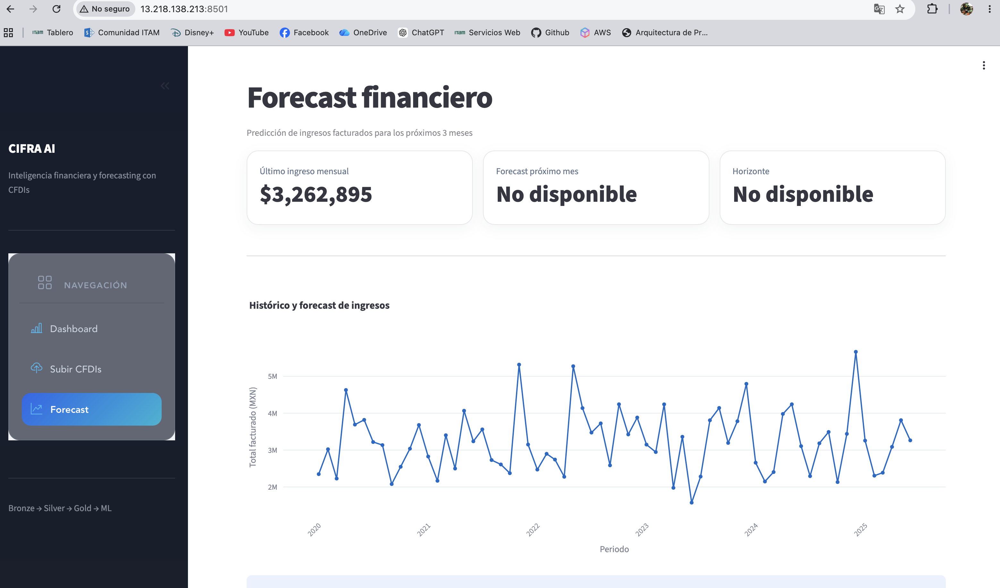

# CIFRA
### CFDI Intelligence, Forecasting & Reporting Architecture

Pipeline de datos end-to-end sobre AWS para ingesta, transformación y análisis de CFDIs (facturas emitidas). Implementa arquitectura Medallion (Bronze → Silver → Gold) con una app Streamlit para carga y visualización, y modelos de forecasting de flujo de caja.

---

## Integrantes

- Manuel De la Tejera
- Andrés Padrón

---

# Arquitectura General

```text
Streamlit App
     │  (upload XML)
     ▼
API Gateway → Lambda (ingest)
                    │
                    ▼
           S3 Bronze (raw XML)
                    │
              Glue Job (ETL)
                    │
                    ▼
           S3 Silver (Parquet)
                    │
          ┌─────────┴──────────┐
          ▼                    ▼
    Amazon Athena         SageMaker
   (análisis SQL)       (forecasting)
          │                    │
          └─────────┬──────────┘
                    ▼
           S3 Gold (agregados)
                    │
                    ▼
           Streamlit Dashboard
```

---

# Arquitectura AWS

La solución fue desplegada completamente sobre AWS utilizando una arquitectura orientada a Data Engineering, Analytics y Machine Learning.

El flujo implementado sigue el patrón:

```text
XML CFDI → S3 Bronze → Glue ETL → S3 Silver → Athena → Streamlit Dashboard → Forecasting
```

La infraestructura integra servicios serverless, Data Lake Medallion, consultas analíticas y despliegue mediante contenedores Docker sobre ECS Fargate.

---

## Diagrama de arquitectura



---

# Data Lake Medallion

Se implementó una arquitectura Medallion (Bronze → Silver → Gold) sobre Amazon S3.

## Amazon S3 Data Lake


### Bronze Layer
- Almacenamiento de XMLs CFDI originales
- Persistencia histórica
- Datos sin transformación

### Silver Layer
- CFDIs parseados y normalizados
- Conversión a formato Parquet
- Limpieza y tipado de columnas

### Gold Layer
- Agregaciones financieras
- KPIs
- Series temporales
- Features para forecasting

---

# AWS Glue Data Catalog

El esquema de los CFDIs procesados fue registrado automáticamente en AWS Glue Data Catalog.

## Glue Catalog


Columnas registradas:
- RFC emisor
- RFC receptor
- Método de pago
- Forma de pago
- Fecha de emisión
- Tipo de comprobante
- Moneda
- Régimen fiscal
- Total facturado

---

# Consultas analíticas con Athena

Amazon Athena fue utilizado para ejecutar consultas SQL directamente sobre los datos almacenados en S3.

## Athena Query


Ejemplos de análisis:
- Ingresos mensuales
- Evolución temporal
- KPIs financieros
- Top clientes
- Distribución de métodos de pago

---

# Containerización y despliegue

La aplicación fue dockerizada y publicada en Amazon ECR.

## Amazon ECR


La imagen Docker contiene:
- Streamlit App
- Conector Athena
- Visualizaciones financieras
- Forecasting
- Integración con AWS

---

# ECS Fargate Deployment

La aplicación fue desplegada sobre ECS Fargate.

## ECS Cluster y servicio



Características:
- Infraestructura serverless
- Contenedores administrados
- Escalabilidad automática
- Integración con ECR
- Networking mediante VPC
- Seguridad mediante Security Groups

---

# Streamlit Application

La capa de presentación fue desarrollada con Streamlit.

---

## Dashboard principal



Incluye:
- KPIs financieros
- Top clientes
- Distribución de CFDIs
- Análisis de pagos
- Visualizaciones interactivas

---

## Carga de CFDIs



La aplicación permite:
- Validación de XMLs CFDI
- Extracción automática de campos
- Vista previa de información
- Integración con pipeline Bronze → Silver → Gold

---

## Forecast financiero



Incluye:
- Series temporales
- Forecast de ingresos
- Tendencias financieras
- Métricas agregadas

---

# Capas del Datalake

| Capa | Formato | Contenido |
|---|---|---|
| Bronze | XML original | CFDIs sin modificar |
| Silver | Parquet | CFDIs parseados y limpios |
| Gold | Parquet | Agregaciones y features analíticos |

---

# Estructura del repositorio

```text
cifra/
├── ingestion/
├── bronze/
├── silver/
├── gold/
├── ml/
├── app/
├── infrastructure/
├── data/
├── notebooks/
└── docs/
```

---

# Setup

```bash
git clone https://github.com/ManuelDLTG/cifra.git
cd cifra

python -m venv .venv
source .venv/bin/activate

pip install -r requirements.txt
```

---

# Ejecutar aplicación localmente

```bash
streamlit run app/main.py
```

---

# Deploy infraestructura AWS

```bash
aws cloudformation deploy \
  --template-file infrastructure/cloudformation/cifra_stack.yaml \
  --stack-name cifra-stack \
  --capabilities CAPABILITY_IAM
```

---

# Servicios AWS utilizados

| Servicio | Uso |
|---|---|
| Amazon S3 | Data Lake Medallion |
| AWS Lambda | Procesamiento serverless |
| AWS Glue | ETL y catálogo |
| Amazon Athena | SQL Analytics |
| Amazon ECS Fargate | Deploy serverless |
| Amazon ECR | Registro Docker |
| AWS IAM | Roles y permisos |
| AWS CloudWatch | Logging |
| Amazon SageMaker | Forecasting |
| Streamlit | Dashboard interactivo |

---

# Stack tecnológico

- Python
- PySpark
- Streamlit
- Docker
- AWS Glue
- Amazon Athena
- Amazon ECS Fargate
- Amazon ECR
- Amazon S3
- Amazon SageMaker

---

# Características técnicas

- Arquitectura Medallion
- ETL serverless
- Query engine desacoplado
- Forecasting financiero
- Infraestructura cloud-native
- Docker + ECS
- Dashboard interactivo
- Pipeline reproducible

---

# Resultados

El proyecto logró implementar exitosamente:

- Pipeline end-to-end sobre AWS
- Procesamiento escalable de CFDIs
- Data Lake Medallion
- Dashboard financiero interactivo
- Forecasting financiero
- Integración entre S3, Glue, Athena y ECS
- Aplicación desplegada públicamente mediante ECS Fargate

---

# Datos

Los CFDIs utilizados corresponden a datos de ejemplo y pruebas académicas. No se incluyen CFDIs reales sensibles dentro del repositorio.
