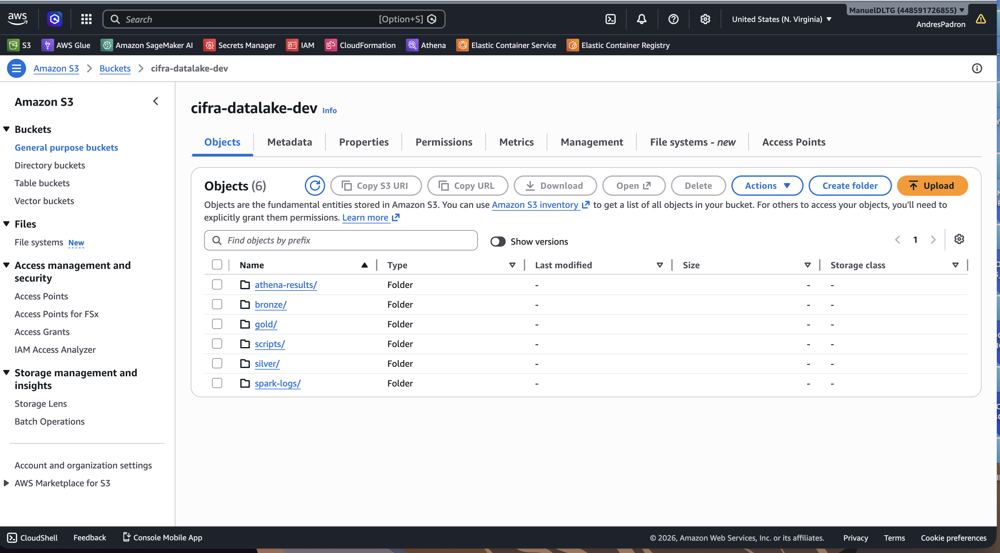
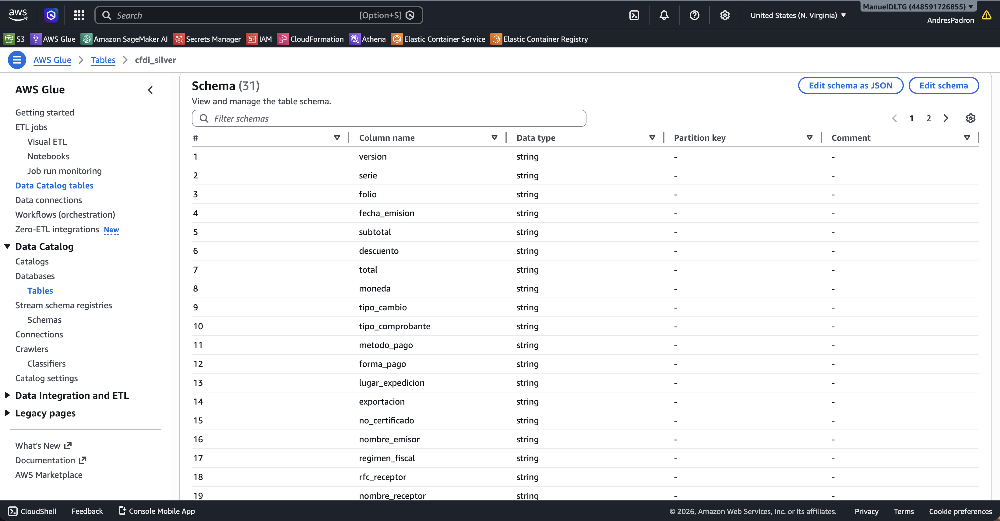
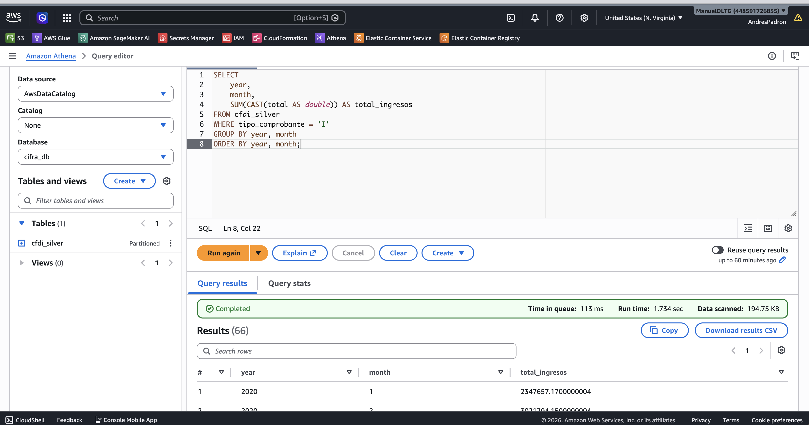
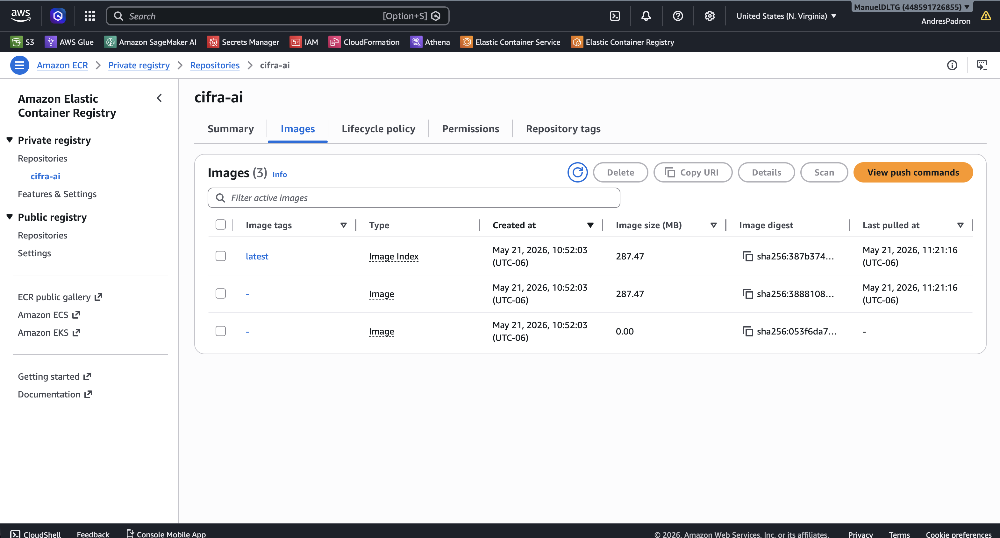
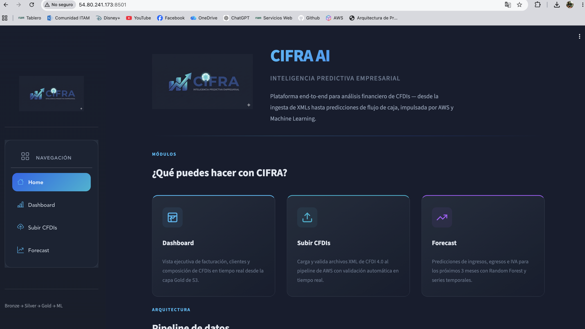
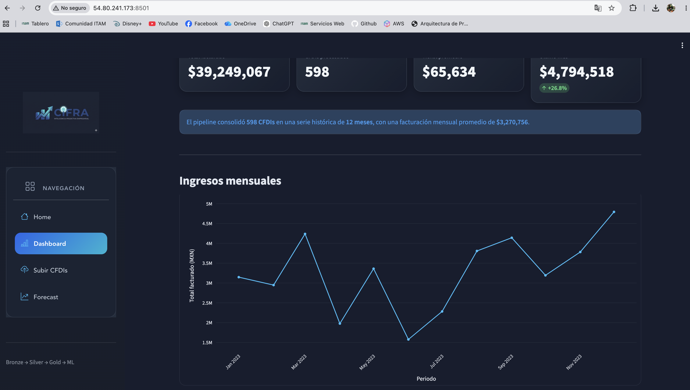
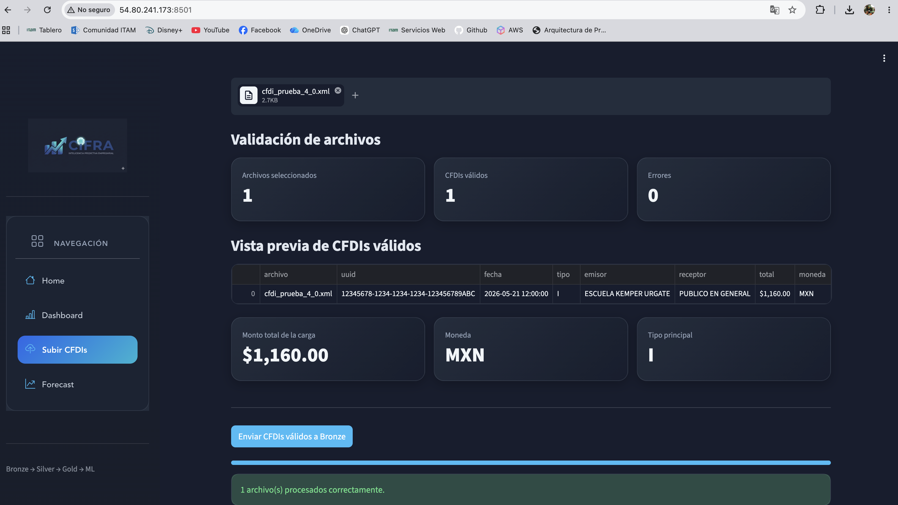
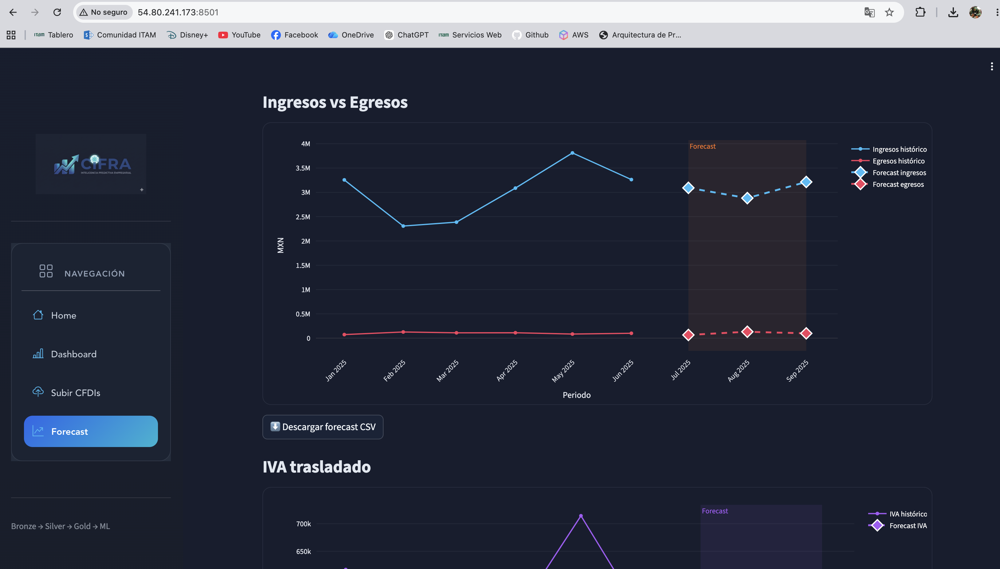

# CIFRA AI
### Plataforma de Inteligencia Predictiva Empresarial basada en CFDIs

Pipeline end-to-end sobre AWS para ingesta, transformación, análisis y forecasting financiero utilizando CFDIs (Comprobantes Fiscales Digitales por Internet).

La solución implementa una arquitectura Medallion (Bronze → Silver → Gold), integrando procesamiento serverless, analítica SQL, visualización interactiva y modelos de Machine Learning para predicción de flujo de caja.

---

## Integrantes

- Manuel De la Tejera
- Andrés Padrón

---

# Aplicación pública

Disponible en:

```text
http://3.81.218.20:8501//
```

---

# Arquitectura General

```text
Streamlit App
     │
     │ Upload CFDI XML
     ▼
API Gateway
     │
     ▼
AWS Lambda (ingest_function)
     │
     ├── Validación XML
     ├── Parsing CFDI
     ├── Detección de duplicados
     └── Particionado automático
     ▼
Amazon S3 Bronze
     │
     ▼
AWS Glue ETL
     │
     ▼
Amazon S3 Silver (Parquet)
     │
     ├───────────────┐
     ▼               ▼
Amazon Athena     SageMaker
(SQL Analytics)   Forecasting
     │               │
     └───────┬───────┘
             ▼
Amazon S3 Gold
             │
             ▼
Streamlit Dashboard
```

---

# Arquitectura AWS

La solución fue desplegada completamente sobre AWS utilizando servicios orientados a:

- Data Engineering
- Serverless Computing
- Data Lake Analytics
- Machine Learning
- Visualización interactiva

---

## Diagrama de arquitectura


---

# Pipeline Medallion

La arquitectura implementa el patrón Bronze → Silver → Gold sobre Amazon S3.

---

## Amazon S3 Data Lake



### Bronze Layer

- Almacenamiento de CFDIs XML originales
- Persistencia histórica
- Detección de duplicados
- Organización por particiones:
  - RFC
  - Año
  - Mes

### Silver Layer

- CFDIs parseados
- Conversión a formato Parquet
- Tipado y limpieza de columnas
- Datos estructurados para analytics

### Gold Layer

- KPIs financieros
- Agregaciones mensuales
- Features de forecasting
- Métricas ejecutivas

---

# Ingesta serverless de CFDIs

La capa de ingestión fue desarrollada utilizando:

- API Gateway
- AWS Lambda
- Amazon S3
- CloudWatch Logs

---

## Flujo de ingestión

1. El usuario carga CFDIs desde Streamlit
2. El XML se valida localmente
3. El archivo se codifica en Base64
4. Streamlit consume el endpoint REST
5. Lambda:
   - decodifica el XML,
   - valida estructura,
   - parsea metadata,
   - verifica duplicados,
   - almacena el CFDI en Bronze

---

## Endpoint REST

```text
POST /dev/upload
```

---

## Funcionalidades implementadas

- Validación XML CFDI
- Extracción automática de metadata
- Detección de duplicados
- Persistencia automática en S3
- Logging con CloudWatch
- Manejo estructurado de errores
- Arquitectura serverless

---

# AWS Glue Data Catalog

Los datos procesados fueron registrados automáticamente en AWS Glue Data Catalog.

---

## Glue Catalog



### Columnas registradas

- RFC emisor
- RFC receptor
- Método de pago
- Forma de pago
- Tipo de comprobante
- Fecha de emisión
- Moneda
- Régimen fiscal
- Total facturado

---

# Consultas analíticas con Athena

Amazon Athena fue utilizado para ejecutar consultas SQL directamente sobre los datos almacenados en S3.

---

## Athena Query



### Análisis implementados

- Ingresos mensuales
- Evolución temporal
- KPIs financieros
- Top clientes
- Métodos de pago
- Distribución de CFDIs

---

# Containerización y despliegue

La aplicación fue dockerizada y desplegada públicamente utilizando Amazon ECR y una instancia EC2 pública.

---

## Amazon ECR



### La imagen Docker contiene

- Streamlit App
- Forecasting
- Conector Athena
- Visualizaciones financieras
- Integración AWS

---

# Aplicación Streamlit

La interfaz interactiva fue desarrollada utilizando Streamlit.
Url pública: http://3.81.218.20:8501/

---

## Home



### Características

- Navegación interactiva
- Arquitectura del pipeline
- Descripción funcional
- Flujo Bronze → Silver → Gold

---

## Dashboard financiero



### Incluye

- KPIs financieros
- Total facturado
- Total CFDIs
- Ticket promedio
- Visualizaciones interactivas
- Series temporales

---

## Validación y carga de CFDIs



### Características

- Validación automática de XMLs CFDI
- Extracción automática de metadata
- Vista previa de CFDIs válidos
- Integración con Lambda
- Persistencia automática en Bronze
- Detección de duplicados

---

## Forecast financiero



### Incluye

- Forecast de ingresos
- Forecast de egresos
- Forecast de IVA
- Series temporales
- Exportación CSV
- Modelos de predicción financiera

---

# Capas del Data Lake

| Capa | Formato | Contenido |
|---|---|---|
| Bronze | XML | CFDIs originales |
| Silver | Parquet | CFDIs parseados |
| Gold | Parquet | KPIs y agregaciones |

---

# Estructura del repositorio

```text
cifra/
├── app/
├── ingestion/
├── infrastructure/
├── bronze/
├── silver/
├── gold/
├── ml/
├── notebooks/
├── docs/
└── data/
```

---

# Setup local

```bash
git clone https://github.com/ManuelDLTG/cifra.git
cd cifra

python -m venv .venv
source .venv/bin/activate

pip install -r requirements.txt
```

---

# Ejecutar Streamlit localmente

```bash
streamlit run app/main.py
```

---

# Docker

## Build

```bash
docker build -t cifra-ai .
```

---

## Run

```bash
docker run -p 8501:8501 cifra-ai
```

---

# AWS Deployment

## Login ECR

```bash
aws ecr get-login-password --region us-east-1 | \
docker login --username AWS --password-stdin <ACCOUNT_ID>.dkr.ecr.us-east-1.amazonaws.com
```

---

## Push Docker image

```bash
docker tag cifra-ai:latest <ACCOUNT_ID>.dkr.ecr.us-east-1.amazonaws.com/cifra-ai:latest

docker push <ACCOUNT_ID>.dkr.ecr.us-east-1.amazonaws.com/cifra-ai:latest
```

---

# Servicios AWS utilizados

| Servicio | Uso |
|---|---|
| Amazon S3 | Data Lake Medallion |
| AWS Lambda | Ingesta serverless |
| API Gateway | Endpoint REST |
| AWS Glue | ETL y catálogo |
| Amazon Athena | SQL Analytics |
| Amazon ECR | Registro Docker |
| Amazon EC2 | Hosting público |
| AWS IAM | Roles y permisos |
| CloudWatch | Logging |
| SageMaker | Forecasting |

---

# Stack tecnológico

- Python
- Streamlit
- Pandas
- Plotly
- Docker
- AWS Lambda
- API Gateway
- Amazon S3
- AWS Glue
- Athena
- SageMaker

---

# Características técnicas

- Arquitectura Medallion
- Pipeline end-to-end
- Procesamiento serverless
- Ingesta automática de CFDIs
- Forecast financiero
- Docker deployment
- Cloud-native architecture
- Dashboard interactivo
- Logging distribuido
- Arquitectura reproducible

---

# Resultados

El proyecto logró implementar exitosamente:

- Pipeline end-to-end sobre AWS
- Arquitectura Medallion
- Ingesta serverless con Lambda
- Persistencia automática en S3
- Dashboard financiero interactivo
- Forecasting financiero
- Integración Athena + Streamlit
- Docker deployment público
- Procesamiento automático de CFDIs
- Arquitectura cloud-native escalable

---

# Datos

Los CFDIs utilizados corresponden a datos de prueba y fines académicos. No se incluyen CFDIs reales sensibles dentro del repositorio.
